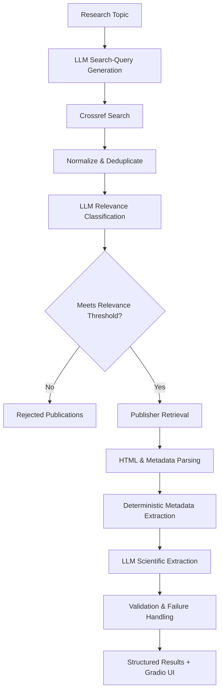
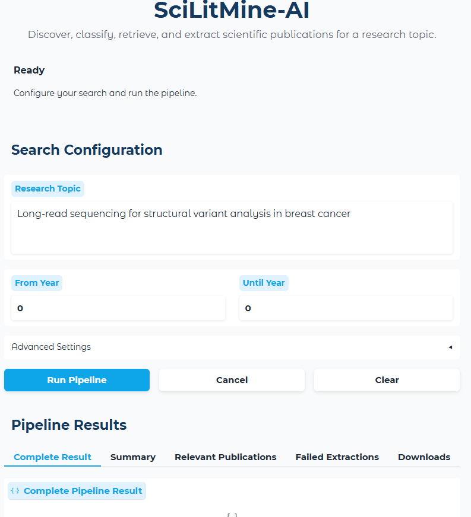

## SciLitMine-AI

### LLM-Assisted Scientific Literature Discovery and Information Extraction

**SciLitMine-AI** is a Python-based scientific information retrieval system that combines scholarly metadata APIs, deterministic data processing, web content extraction, and large language models (LLMs) to automate the discovery, classification, retrieval, and structured extraction of information from scientific literature.

The pipeline starts with a research question and progressively transforms it into a structured collection of relevant scientific publications and extracted research findings.

The system deliberately separates **deterministic processing from LLM reasoning**. Thus, rather than relying on an LLM for every task, the system follows a **hybrid deterministic + LLM architecture**:

- **Python and scholarly APIs** handle publication discovery, normalization, deduplication, metadata extraction, validation, and persistence.
- **LLMs** are used selectively for tasks that benefit from semantic reasoning, including query expansion, relevance classification, and scientific information extraction.

A **Gradio web interface** provides an accessible way to configure searches, run the pipeline, inspect results, review failures, and download structured outputs.

---

## Why SciLitMine-AI?
Scientific literature searches can return many publications containing the right keywords without necessarily answering the underlying research question.

Traditional keyword matching can identify papers containing similar terminology, but keyword overlap does not necessarily mean that a publication is scientifically relevant.

Even after relevant publications are identified, researchers still need to manually:

- review titles and abstracts,
- remove duplicate publications,
- open publisher pages,
- identify study objectives,
- understand experimental approaches,
- extract major findings,
- identify technologies and analytical methods,
- review study limitations,
- locate associated datasets and repositories.

SciLitMine-AI explores how these tasks can be partially automated while keeping the workflow:

- **Grounded** in real scholarly publications
- **Structured** through machine-readable outputs
- **Traceable** across pipeline stages
- **Fault tolerant** when individual publications fail
- **Selective** about where LLM reasoning is used

The goal is not to replace expert scientific review, but to reduce the manual effort required to move from a research question to an organized set of potentially relevant publications and extracted scientific information.

---

## Pipeline Architecture



---

## How it works

### 1. LLM-Assisted Search Strategy Generation

The workflow begins with a user-defined scientific research topic:

For example:

```text
Long-read sequencing for structural variant analysis in breast cancer
```

Rather than relying on a single search string, an LLM expands the research topic into multiple focused literature-search queries.

This helps improve search coverage because related publications may describe similar scientific concepts using different terminology, technologies, disease contexts, or analytical approaches.

Importantly, the LLM generates the **search strategy**. It does **not** generate the publications themselves.

---

### 2. Scholarly Publication Discovery

The generated queries are submitted programmatically to the **Crossref API**.

Crossref provides structured scholarly metadata that may include:

- article title,
- authors,
- DOI,
- journal,
- publication date,
- publisher,
- article type,
- abstract when available,
- article URL.

This keeps publication discovery grounded in an external scholarly metadata source rather than relying on LLM-generated citations.

---

### 3. DOI Normalization and Deduplication

Different search queries can retrieve the same publication.

Before publications are sent to downstream LLM processing, SciLitMine-AI normalizes identifiers and removes duplicate records.

The DOI is used as the primary identifier when available.

For example:

```text
https://doi.org/10.xxxx/example
doi:10.xxxx/example
10.xxxx/example
```

are normalized into a consistent DOI representation:

```text
10.xxxx/example
```

When a DOI is unavailable, a normalized article title can be used as a fallback identifier for duplicate detection.

This prevents the same publication from being classified and processed multiple times unnecessarily.

---

### 4. Semantic Relevance Classification

Not every publication returned by a keyword-based search is scientifically relevant to the research question.

A publication may contain terms from the research topic while investigating a substantially different biological question, disease, sequencing application, or analytical problem.

SciLitMine-AI therefore uses an LLM to evaluate candidate publications using available metadata, particularly the title and abstract.

The classifier returns structured information such as:

```json
{
  "is_relevant": true,
  "relevance_score": 0.8,
  "reason": "The study directly investigates...",
  "matched_concepts": [
    "long-read sequencing",
    "structural variants"
  ]
}
```

A configurable relevance threshold determines which publications proceed to the retrieval and extraction stages.

For example:

```text
relevance_threshold = 0.70
```

Publications below the threshold are retained as rejected publications rather than silently discarded.

---

## Why Filter Before Extraction?

One of the architectural principles of the project is:

> **Do not perform expensive downstream processing on publications that are unlikely to answer the research question.**

Instead of retrieving and processing every candidate publication, the pipeline progressively reduces the search space:

```text
Raw Candidates
      ↓
Unique Candidates
      ↓
Semantically Classified Candidates
      ↓
Relevant Publications
      ↓
Article Retrieval
      ↓
Scientific Extraction
```

Filtering before publisher retrieval also reduces unnecessary HTTP requests and downstream LLM calls.

---

## Publisher Retrieval and Web Content Processing

For publications classified as relevant, the pipeline resolves the DOI and attempts to retrieve the corresponding publisher webpage.

The retrieval layer uses:

- `requests`
- `BeautifulSoup`
- HTML metadata
- citation meta tags
- JSON-LD

Common webpage boilerplate such as scripts, styles, navigation elements, forms, headers, and footers is removed before downstream scientific extraction.

The goal is to provide the extraction model with the most relevant accessible scientific content while minimizing unrelated webpage text.

SciLitMine-AI respects publisher access restrictions and does **not** attempt to bypass authentication systems, paywalls, or other access controls.

---

## 6. Deterministic Extraction + Evidence-Grounded LLM Extraction

A central design principle of **SciLitMine-AI** is to separate information that can be extracted deterministically from information that requires semantic interpretation.

### Deterministic extraction

Python, Crossref metadata, HTML citation tags, and JSON-LD are used for bibliographic fields such as:

- DOI
- title
- authors
- journal
- publication date
- publisher
- canonical URL
- available abstract

These fields should not depend unnecessarily on generative model output.

### LLM-based extraction

The LLM is reserved for information requiring semantic interpretation, such as:

- study objective,
- experimental or computational methods,
- major findings,
- study limitations,
- data repositories or accession information when supported by the retrieved content.

The extraction model is instructed to use the supplied publication content rather than filling missing information with outside knowledge.

If information cannot be supported by the available evidence, the pipeline is designed to preserve that uncertainty rather than invent a value.

After LLM extraction, important bibliographic fields are reconciled with deterministic metadata so that the model does not become the source of truth for publication identity.

This creates a clearer boundary between:

> **Retrieved facts** and **model-derived scientific interpretation**

---

## 7. Access-Level Awareness

Not every publisher page exposes the same amount of scientific content.

The pipeline evaluates the content available for downstream extraction and can distinguish among states such as:

```text
full_text
abstract_only
metadata_and_page_text
metadata_only
```

This distinction is important because the amount of accessible evidence affects what the extraction model can reasonably determine.

For example, a publication for which only bibliographic metadata is available should not be treated as though its complete methods and results were successfully retrieved.

Publisher access failures, including blocked requests, are captured separately through the pipeline's failure-handling mechanism.

---

## 8. Failure-Tolerant Processing

Scientific web retrieval is inherently inconsistent.

A publisher may:

- return `403 Forbidden`,
- reject automated requests,
- redirect DOI requests,
- expose only limited content (metadata or an abstract),
- return unexpected HTML,
- time out,
- provide content that cannot be parsed reliably.

LLM calls may also fail, return malformed structured output, or produce an empty response.

SciLitMine-AI is designed so that a failure affecting one publication does not necessarily terminate the entire pipeline.

Instead, the publication-level error is captured with information such as:

```json
{
  "title": "Example publication",
  "doi": "10.xxxx/example",
  "article_url": "https://doi.org/10.xxxx/example",
  "error": "403 Client Error: Forbidden"
}
```

and processing continues with the remaining publications.

Failures are tracked separately for:

- search queries,
- relevance classification,
- article retrieval/extraction.

This makes failed records visible instead of silently dropping them.

---

## Structured Pipeline Output

Each run produces a structured summary describing how publications moved through the workflow.

For example:

```json
{
  "summary": {
    "queries_generated": 5,
    "raw_candidates": 50,
    "unique_candidates": 48,
    "classified_candidates": 48,
    "relevant_publications": 6,
    "successful_extractions": 4,
    "failed_extractions": 2
  }
}
```

> The values above are illustrative. Actual results depend on the research topic, search configuration, publication metadata, publisher accessibility, and model responses.

The final pipeline result can contain:

- pipeline metadata
- generated search strategy
- summary statistics
- successfully processed publications
- rejected publications
- failed search queries
- failed relevance classifications
- failed article extractions

Results are persisted as structured JSON for downstream analysis or reuse.

---

# Gradio Web Interface

SciLitMine-AI includes a **Gradio web interface** that allows users to run and configure the literature mining workflow without modifying the underlying Python code.

### Search Configuration

Users can specify:

- research topic
- starting publication year
- ending publication year

### Advanced Settings

Users can configure:

- maximum number of generated search queries,
- number of results retrieved per query,
- maximum number of candidates sent for LLM classification,
- semantic relevance threshold.

### Results

The interface provides views for:

- pipeline status,
- summary statistics,
- structured JSON results,
- relevant-publication table,
- failed-extraction table,
- downloadable JSON results.

This allows both successful results and failures to remain visible to the user.

<!-- Add a screenshot when available:



-->

---

## Example Research Question

One research topic used during development is:

```text
Long-read sequencing for structural variant analysis in breast cancer
```

The query generation stage produce search strategies covering concepts such as:

```text
long-read sequencing structural variants breast cancer

PacBio structural variant detection breast cancer

Oxford Nanopore structural variation breast cancer

long-read genomic sequencing breast cancer rearrangements
```

The queries are illustrative. Actual search queries are generated dynamically and may vary between runs.

---

# Technology Stack

| Area | Technologies |
|---|---|
| Programming | Python |
| LLM Integration | OpenAI-compatible APIs / configurable LLM providers |
| Scholarly Discovery | Crossref REST API |
| HTTP Retrieval | Requests |
| HTML Parsing | BeautifulSoup |
| Structured Metadata | HTML citation metadata, JSON-LD |
| Data Processing | Pandas |
| Structured Output | JSON|
| User Interface | Gradio |

---

# Design Principles

SciLitMine-AI is built around three primary engineering principles:

### Ground discovery in real scholarly sources

LLMs generate search strategies, while publication discovery is performed against external scholarly metadata.

### Use deterministic methods whenever possible

Publication identifiers, metadata, normalization, validation, and persistence should not depend unnecessarily on generative models.

### Reserve LLMs for semantic reasoning

LLMs are used where interpretation adds value, particularly search-query generation, relevance classification, and scientific information extraction.

The pipeline also preserves failures and partial-information states rather than silently discarding them.

---

# Current Limitations

SciLitMine-AI is under active development and currently has several limitations:

- Publisher websites may block automated retrieval.
- Full text is not available for every publication.
- HTML structure varies substantially among publishers.
- Semantic relevance classification depends on the quality and completeness of available metadata.
- LLM outputs remain probabilistic and require validation.
- Publisher-access restrictions can limit the evidence available for scientific extraction.
- Retrieval and LLM extraction failures are not yet fully separated into independent failure categories.
- Relevance classification and extraction quality have not yet been systematically benchmarked against a manually curated reference dataset.

The pipeline does **not** attempt to bypass publisher authentication, paywalls, or access restrictions.

---

# Roadmap

Planned improvements include:

- [ ] Add resilient metadata-only fallback for publisher-blocked publications
- [ ] Integrate additional scholarly sources such as PubMed and Europe PMC
- [ ] Distinguish retrieval, parsing, and LLM extraction failures
- [ ] Add retry/backoff strategies and search-result caching
- [ ] Build a human-reviewed evaluation set for relevance classification and scientific extraction
- [ ] Add automated tests, CI/CD, and containerized deployment

---

# Project Status

> **Active Development / Research Prototype**

SciLitMine-AI is functional and is being actively improved with an emphasis on retrieval reliability, evaluation, model orchestration, and evidence-grounded scientific information extraction.

The project should currently be considered a research and engineering prototype rather than a replacement for systematic-review platforms or expert scientific review.

---

# What This Project Demonstrates

---

# What This Project Demonstrates

SciLitMine-AI explores practical LLM engineering concepts including **model orchestration, retrieval-grounded LLM workflows, semantic classification, structured model outputs, API integration, scientific web-content extraction, deterministic + probabilistic system design, validation, and fault-tolerant workflow orchestration**.

At its core, the project explores a broader engineering question:

> **Where should an LLM be used in a scientific workflow and where should deterministic software remain in control?**

---

## Disclaimer

This project is intended for research, educational, and software-development purposes.

Extracted information should be verified against the original scientific publication before being used for research, clinical, regulatory, or other high-stakes decisions.

Publisher terms of service, copyright restrictions, and access controls should always be respected.

---

## Author

**Samuel Adjei, Ph.D.**

Scientist | Computational Biology | Genomics | Data Science | AI/LLM Engineering

---

## License

This project is licensed under the [MIT License](LICENSE).
