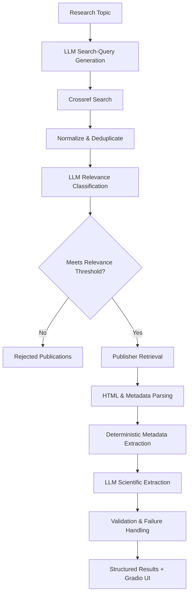

## SciLitMine-AI

### LLM-Assisted Scientific Literature Discovery and Information Extraction


[](LICENSE)


**SciLitMine-AI** is a Python-based scientific literature mining system that combines scholarly metadata APIs, deterministic data processing, web content extraction, and large language models (LLMs) to automate the discovery, classification, retrieval, and structured extraction of information from scientific literature.

The system uses a **hybrid deterministic + LLM architecture**:

- **Python and scholarly APIs** handle publication discovery, normalization, deduplication, metadata extraction, validation, and persistence.
- **LLMs** are used selectively for tasks that benefit from semantic reasoning, including query expansion, relevance classification, and scientific information extraction.

A **Gradio web interface** allows users to configure searches, run the pipeline, inspect failures and results, and download structured outputs.

---

## Why SciLitMine-AI?

Literature searches often return many publications that match the right keywords but are not necessarily relevant to the research question. Researchers must manually review those publications to identify the most useful studies and extract key information.

SciLitMine-AI was built to reduce that manual effort by automating literature discovery, relevant screening, and structured information extraction.

The goal is not to replace expert scientific review, but to help researchers move more efficiently from a research question to an organized set of relevant publications and extracted findings.

---

## Pipeline Architecture



---

## How it works

### 1. LLM-Assisted Search Strategy Generation

The workflow begins with a user-defined scientific research topic:

```text
Long-read sequencing for structural variant analysis in breast cancer
```

An LLM expands the research topic into multiple focused literature-search queries.This helps improve search coverage because related publications may describe similar scientific concepts using different terminology, technologies, disease contexts, or analytical approaches.

Importantly, the LLM generates the **search strategy** and **not** the publications themselves.

---

### 2. Scholarly Publication Discovery

The generated queries are submitted programmatically to the **Crossref API** to retrieve real scholarly publications and available metadata including:

- article title and authors,
- DOI and article URL,
- journal and publisher,
- publication date,
- abstract when available,

This keeps publication discovery grounded in an external scholarly metadata source rather than relying on LLM-generated citations.

---

### 3. DOI Normalization and Deduplication

Because multiple search queries can return the same publication, SciLitMine-AI normalizes DOIs and removes duplicate before records are sent to downstream LLM processing.

For example:

```text
https://doi.org/10.xxxx/example
doi:10.xxxx/example
10.xxxx/example
```

become:

```text
10.xxxx/example
```

DOI is used as the primary identifier. When a DOI is unavailable, a normalized article title can be used as a fallback identifier for duplicate detection.

This prevents the same publication from being classified and processed multiple times unnecessarily.

---

### 4. Semantic Relevance Classification

An LLM evaluates each candidate using available publication metadata, particularly the title and abstract, to determine its relevance to the research topic.

The classifier returns structured information such as:

```json
{
  "is_relevant": true,
  "relevance_score": 0.8,
  "reason": "The study directly investigates...",
  "matched_concepts": [
    "long-read sequencing",
    "structural variants"
  ]
}
```

A configurable relevance threshold determines which publications proceed to the article retrieval and information extraction stages. This reduces unnecessary HTTP requests and LLM calls.

For example:

```text
relevance_threshold = 0.70
```

Publications below the threshold are retained as rejected publications rather than silently discarded.

---

## Publisher Retrieval and Web Content Processing

For publications classified as relevant, **SciLitMine-AI** resolves the DOI and attempts to retrieve the corresponding publisher webpage using `requests` and `BeautifulSoup`.

The pipeline extracts available HTML metadata, citation meta tags, JSON-LD, and article text while removing common webpage boilerplate before downstream scientific extraction.

The goal is to provide the extraction model with the most relevant accessible scientific content while minimizing unrelated webpage text.

SciLitMine-AI respects publisher access restrictions and does **not** attempt to bypass authentication systems, paywalls, or other access controls.

---

## 6. Deterministic Extraction + Evidence-Grounded LLM Extraction

A central design principle of **SciLitMine-AI** is to separate information that can reliably extracted from information that requires semantic interpretation.

**Deterministic extraction** handles bibliographic information such as DOI, title, authors, journal, publication date, publisher, URL, and available abstract using Crossref and webpage metadata.

**LLM-based extraction** is reserved for scientific interpretation, including:

- study objectives
- methods
- major findings
- limitations
- data repositories or accession information

The LLM is instructed to use only the supplied publication content rather than filling missing information with outside knowledge.

If information cannot be supported by the available evidence, the pipeline is designed to preserve that uncertainty rather than invent a value.

> **Retrieved metadata remains authoritative; the LLM handles scientific interpretation.**

---

Available content is categorized as `full_text`, `abstract_only`, `metadata_and_page_text`, or `metadata_only`, allowing extraction to reflect the evidence actually available for each publication.

---

## 7. Failure-Tolerant Processing

Publisher retrieval and LLM processing can fail because of blocked requests, timeouts, inaccessible content, unexpected HTML, or malformed model responses.

SciLitMine-AI isolates failures at the publication level so that one failed article does not terminate the entire pipeline.

Failed records retain the publication title, DOI, URL, and error information for troubleshooting, while processing continues with the remaining publications.

Failures are tracked across:

- search queries
- relevance classification
- article retrieval/extraction

---

## Structured Pipeline Output

Each run produces structured JSON containing pipeline metadata, search strategy, processed publications, rejected publications, failures, and summary statistics.

For example:

```json
{
  "summary": {
    "queries_generated": 5,
    "raw_candidates": 50,
    "unique_candidates": 48,
    "classified_candidates": 48,
    "relevant_publications": 6,
    "successful_extractions": 4,
    "failed_extractions": 2
  }
}
```

---

# Gradio Web Interface

SciLitMine-AI includes a **Gradio web interface** to configure searches, run the pipeline, retrieve relevant publications and failures, and download structured results.

### Search Configuration

Users can specify:

- research topic
- starting publication year
- ending publication year

### Advanced Settings

Users can configure:

- maximum number of generated search queries,
- number of results retrieved per query,
- maximum number of candidates sent for LLM classification,
- semantic relevance threshold.

<p align="center">
  
</p>

### Results

The interface provides views for:

- pipeline status,
- summary statistics,
- structured JSON results,
- relevant-publication table,
- failed-extraction table,
- downloadable JSON results.

This allows both successful results and failures to remain visible to the user.

---

# Technology Stack

| Area | Technologies |
|---|---|
| Programming | Python |
| LLM Integration | OpenAI-compatible APIs / configurable LLM providers |
| Scholarly Discovery | Crossref REST API |
| HTTP Retrieval | Requests |
| HTML Parsing | BeautifulSoup |
| Structured Metadata | HTML citation metadata, JSON-LD |
| Data Processing | Pandas |
| Structured Output | JSON|
| User Interface | Gradio |

---

## Current Limitations

SciLitMine-AI is under active development. Current limitations include:

- Publisher access restrictions may limit full-text retrieval.
- Publisher HTML structures vary and may affect content extraction.
- LLM classification and extraction remain probabilistic and require validation.
- Relevance classification and extraction quality have not yet been systematically benchmarked against a manually curated reference dataset.

The pipeline does **not** bypass publisher authentication, paywalls, or access restrictions.

---

# Roadmap

Planned improvements include:

- [ ] Add resilient metadata-only fallback for publisher-blocked publications
- [ ] Integrate additional scholarly sources such as PubMed and Europe PMC
- [ ] Separate retrieval, parsing, and LLM extraction failures with retry/caching support
- [ ] Build a human-reviewed evaluation set for relevance classification and scientific extraction

---

## Disclaimer

This project is intended for research, educational, and software-development purposes.

Extracted information should be verified against the original scientific publication before being used for research, clinical, regulatory, or other high-stakes decisions.

Publisher terms of service, copyright restrictions, and access controls should always be respected.

---

## Author

**Samuel Adjei, Ph.D.**

Scientist | Computational Biology | Genomics | Data Science | AI/LLM Engineering

---

## License

This project is licensed under the [MIT License](LICENSE).
